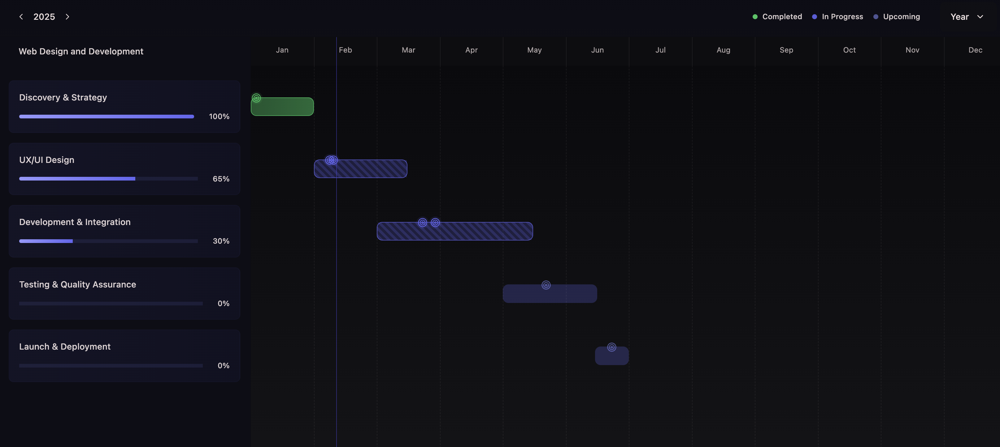

# ARKM Suite 📊



## 📋 Description

ARKM Suite is a centralized project management portal offering an interactive dashboard, detailed progress tracking through Gantt timelines, and a comprehensive deliverables system. It's optimized to improve communication between teams and clients, making project management more efficient and transparent.

## ✨ Features

- **Interactive dashboard** - Complete visualization of project status
- **Progress tracking** - Detailed Gantt timelines
- **Deliverables system** - Management and tracking of documents and outcomes
- **Access control** - Custom permissions for different user roles
- **Integrated communication** - Tools to facilitate communication between teams and clients
- **Dark/light mode** - Interface customization according to user preferences

## 🛠️ Technologies

- **React** - JavaScript library for building user interfaces
- **TypeScript** - JavaScript superset with static typing
- **Next.js** - React framework for web applications
- **SASS** - CSS preprocessor for more efficient styling
- **RESTful API** - Architecture for backend communication
- **Recharts** - Library for data visualization
- **Next Auth** - Authentication and access control system

## 🚀 Installation and Usage

```bash
# Clone the repository
git clone https://github.com/kap-94/arkm-suite.git

# Navigate to the directory
cd arkm-suite

# Install dependencies
npm install

# Configure environment variables
cp .env.example .env.local
# Edit .env.local with your credentials and settings

# Start development server
npm run dev

# Build for production
npm run build

# Start production server
npm start
```

## 🔒 Authentication Configuration

To configure authentication and access control, you'll need to:

1. Set up your authentication providers in the `.env.local` file

## 🌐 Links

- **Live demo**: [ARKM Suite Dashboard](https://arkm-suite.vercel.app/en/dashboard)
- **Repository**: [GitHub](https://github.com/kap-94/arkm-suite)

## 📸 Screenshots


## 📝 License

This project is licensed under the MIT License - see the [LICENSE.md](LICENSE.md) file for details.

## 👨‍💻 Author

Developed by Pablo Karam - [See more projects](https://www.pablokaram.com)
